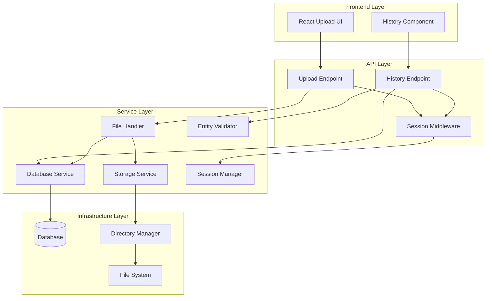

# Design Document: File Upload Storage Fix

## Overview

This design addresses the file upload storage issue in the PortAda application by implementing a comprehensive solution that includes automatic directory creation, database persistence, session management, and processing history tracking. The solution transforms the current fragile file upload system into a robust, scalable architecture that can handle concurrent uploads, maintain processing history, and provide a seamless user experience.

The core architecture introduces several new components: a Database Service for persistence, a Session Manager for user state management, a History Endpoint for processing records, and enhanced error handling throughout the upload pipeline.

## Architecture

The system follows a layered architecture with clear separation of concerns:



## Components and Interfaces

### Storage Service
The Storage Service is responsible for managing file storage operations and ensuring directory structure integrity.

**Interface:**
```python
class StorageService:
    def __init__(self, base_path: str = ".storage/ingestion/")
    def ensure_directory_exists(self, path: str) -> bool
    def save_file(self, file_content: bytes, filename: str) -> str
    def validate_storage_path(self, path: str) -> bool
    def get_available_space(self) -> int
    def cleanup_temp_files(self) -> None
```

**Key Responsibilities:**
- Automatic directory creation with proper permissions
- Atomic file write operations
- Storage validation and space checking
- Temporary file cleanup

### Database Service
The Database Service handles all database operations including schema management, record persistence, and query operations.

**Interface:**
```python
class DatabaseService:
    def __init__(self, database_url: str)
    def initialize_schema(self) -> None
    def create_processing_record(self, record: ProcessingRecord) -> str
    def update_processing_status(self, record_id: str, status: str) -> bool
    def get_processing_history(self, session_id: str, filters: dict) -> List[ProcessingRecord]
    def cleanup_expired_sessions(self) -> int
```

**Schema Design:**
```sql
-- Sessions table
CREATE TABLE sessions (
    id UUID PRIMARY KEY,
    created_at TIMESTAMP DEFAULT CURRENT_TIMESTAMP,
    last_accessed TIMESTAMP DEFAULT CURRENT_TIMESTAMP,
    expires_at TIMESTAMP,
    metadata JSONB
);

-- Processing records table
CREATE TABLE processing_records (
    id UUID PRIMARY KEY,
    session_id UUID REFERENCES sessions(id),
    original_filename VARCHAR(255) NOT NULL,
    stored_filename VARCHAR(255) NOT NULL,
    file_size BIGINT NOT NULL,
    upload_timestamp TIMESTAMP DEFAULT CURRENT_TIMESTAMP,
    processing_status VARCHAR(50) DEFAULT 'uploaded',
    error_message TEXT,
    metadata JSONB
);

-- Indexes for efficient querying
CREATE INDEX idx_processing_records_session_id ON processing_records(session_id);
CREATE INDEX idx_processing_records_timestamp ON processing_records(upload_timestamp);
CREATE INDEX idx_sessions_expires_at ON sessions(expires_at);
```

### Session Manager
The Session Manager handles user session lifecycle, persistence, and state management.

**Interface:**
```python
class SessionManager:
    def __init__(self, database_service: DatabaseService)
    def create_or_get_session(self, request: Request) -> Session
    def update_session_access(self, session_id: str) -> None
    def is_session_valid(self, session_id: str) -> bool
    def cleanup_expired_sessions(self) -> None
```

### File Handler
Enhanced File Handler that integrates with database persistence and improved error handling.

**Interface:**
```python
class FileHandler:
    def __init__(self, storage_service: StorageService, database_service: DatabaseService)
    def process_upload(self, file: UploadFile, session_id: str) -> ProcessingResult
    def generate_unique_filename(self, original_name: str) -> str
    def validate_file(self, file: UploadFile) -> ValidationResult
    def create_processing_record(self, file_info: dict, session_id: str) -> str
```

### Entity Validator
The Entity Validator ensures data consistency between backend and frontend.

**Interface:**
```python
class EntityValidator:
    def validate_processing_record(self, record: ProcessingRecord) -> dict
    def transform_for_frontend(self, records: List[ProcessingRecord]) -> List[dict]
    def sanitize_entity(self, entity: dict) -> dict
    def validate_required_fields(self, entity: dict, required_fields: List[str]) -> bool
```

## Data Models

### ProcessingRecord
```python
@dataclass
class ProcessingRecord:
    id: str
    session_id: str
    original_filename: str
    stored_filename: str
    file_size: int
    upload_timestamp: datetime
    processing_status: str  # 'uploaded', 'processing', 'completed', 'failed'
    error_message: Optional[str] = None
    metadata: Optional[dict] = None
```

### Session
```python
@dataclass
class Session:
    id: str
    created_at: datetime
    last_accessed: datetime
    expires_at: datetime
    metadata: Optional[dict] = None
```

### ProcessingResult
```python
@dataclass
class ProcessingResult:
    success: bool
    record_id: Optional[str] = None
    error_message: Optional[str] = None
    file_path: Optional[str] = None
```

## Correctness Properties

*A property is a characteristic or behavior that should hold true across all valid executions of a system-essentially, a formal statement about what the system should do. Properties serve as the bridge between human-readable specifications and machine-verifiable correctness guarantees.*

Based on the prework analysis, the following properties capture the essential correctness guarantees of the system:

**Property 1: Directory Management Consistency**
*For any* storage service initialization or file upload operation, the directory manager should ensure that all required directories exist with correct permissions before any file operations proceed.
**Validates: Requirements 1.1, 1.3, 4.1**

**Property 2: File Upload Workflow Completeness**
*For any* valid JSON file upload, the complete workflow (UUID generation, atomic file save, database record creation, success response) should execute successfully and the file should be immediately available for reading.
**Validates: Requirements 2.1, 2.2, 5.1**

**Property 3: Atomic File Operations**
*For any* file write operation, the storage service should ensure atomicity such that either the complete file is written successfully or no partial file remains in the storage directory.
**Validates: Requirements 2.5, 3.3**

**Property 4: Error Response Consistency**
*For any* storage-related error condition (permissions, disk space, write failures), the system should return consistent HTTP 500 responses with descriptive error messages and proper logging.
**Validates: Requirements 3.1, 3.2, 3.5**

**Property 5: UUID Uniqueness Guarantee**
*For any* set of file uploads, all generated UUID filenames should be unique within the storage directory, and collision detection should trigger new UUID generation rather than overwriting.
**Validates: Requirements 5.3, 5.5**

**Property 6: Concurrent Upload Safety**
*For any* set of concurrent file upload operations, the storage service should handle them without race conditions, ensuring each upload completes atomically and database records are created consistently.
**Validates: Requirements 5.2, 7.6**

**Property 7: Configuration Handling Robustness**
*For any* storage configuration state (missing, invalid, or valid), the storage service should either apply valid configurations after validation or fall back to sensible defaults, supporting both relative and absolute paths.
**Validates: Requirements 6.1, 6.2, 6.4, 6.5**

**Property 8: Database Record Completeness**
*For any* file upload operation, the database service should create a processing record containing all required fields (original filename, UUID, upload timestamp, file size, processing status) with proper data integrity.
**Validates: Requirements 7.1, 7.4**

**Property 9: Session Lifecycle Management**
*For any* user interaction with the upload system, the session manager should create or retrieve persistent session identifiers and restore processing history when users return to the application.
**Validates: Requirements 8.1, 8.3**

**Property 10: Session Expiration and Cleanup**
*For any* expired session, the database service should clean up associated temporary data while preserving processing records, maintaining configurable session durations.
**Validates: Requirements 8.2, 8.4, 8.5**

**Property 11: Database Schema Consistency**
*For any* application startup, the database service should ensure all required tables, indexes, and constraints exist, supporting both SQLite and PostgreSQL with proper foreign key relationships.
**Validates: Requirements 9.1, 9.2, 9.3, 9.6**

**Property 12: Entity Validation and Transformation**
*For any* processing record sent to the frontend, the entity validator should ensure all required fields are present, properly formatted (ISO timestamps, byte sizes), and transformed into frontend-compatible JSON structures.
**Validates: Requirements 10.1, 10.2, 10.5**

**Property 13: Validation Error Handling**
*For any* entity validation failure or unknown entity, the validator should log errors, filter out problematic entities, and return safe default structures rather than causing frontend errors.
**Validates: Requirements 10.3, 10.4, 10.6**

<function_calls>
<invoke name="prework">
<parameter name="featureName">file-upload-storage-fix

## Error Handling

The system implements comprehensive error handling across all layers:

### Storage Layer Errors
- **Directory Creation Failures**: Return specific error codes with permission details
- **Disk Space Issues**: Pre-flight checks with graceful degradation
- **File Write Failures**: Atomic operations with automatic cleanup
- **Permission Errors**: Automatic correction attempts with fallback logging

### Database Layer Errors
- **Connection Failures**: Retry logic with exponential backoff
- **Transaction Failures**: Automatic rollback with detailed error logging
- **Schema Migration Errors**: Safe migration with backup strategies
- **Constraint Violations**: Graceful handling with user-friendly messages

### API Layer Errors
- **Upload Failures**: HTTP 500 responses with descriptive messages
- **Session Errors**: Automatic session recovery or creation
- **Validation Errors**: HTTP 400 responses with field-specific details
- **Rate Limiting**: HTTP 429 responses with retry-after headers

### Error Recovery Strategies
- **Automatic Retry**: For transient failures (network, temporary disk issues)
- **Graceful Degradation**: Continue operation with reduced functionality when possible
- **Circuit Breaker**: Prevent cascade failures in database operations
- **Dead Letter Queue**: For failed processing records that need manual intervention

## Testing Strategy

The testing approach combines unit tests for specific scenarios with property-based tests for comprehensive coverage:

### Unit Testing
- **Specific Examples**: Test concrete upload scenarios with known inputs
- **Edge Cases**: Empty files, maximum file sizes, special characters in filenames
- **Error Conditions**: Simulated disk full, permission denied, database unavailable
- **Integration Points**: API endpoint responses, database transactions, file system operations

### Property-Based Testing
- **Universal Properties**: Test properties that should hold for all valid inputs
- **Randomized Testing**: Generate random file uploads, session states, and configurations
- **Concurrency Testing**: Verify thread safety and race condition handling
- **Configuration Testing**: Test all valid configuration combinations

**Property Test Configuration:**
- Minimum 100 iterations per property test to ensure statistical confidence
- Each property test references its corresponding design document property
- Tag format: **Feature: file-upload-storage-fix, Property {number}: {property_text}**
- Use pytest-hypothesis for Python property-based testing framework

**Test Coverage Requirements:**
- All correctness properties must be implemented as property-based tests
- Critical error paths must have dedicated unit tests
- Integration tests must cover complete upload workflows
- Performance tests for concurrent upload scenarios

### Database Testing
- **Schema Migration Tests**: Verify migrations work correctly across database versions
- **Data Integrity Tests**: Ensure foreign key constraints and data consistency
- **Performance Tests**: Query performance with large datasets
- **Backup and Recovery Tests**: Verify data persistence and recovery procedures