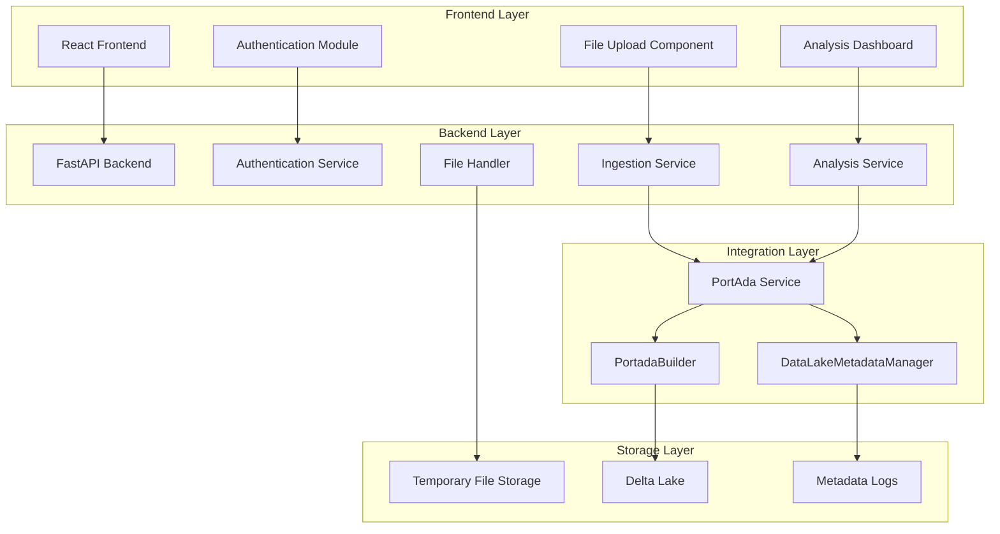

# Design Document

## Overview

The PortAda Data Ingestion and Analysis System is a web-based application that provides a user-friendly interface for managing historical newspaper data through the py-portada-data-layer library. The system enables users to upload and process extraction data and known entities, perform various analytical queries on Delta Lake data, and monitor data processing operations.

The application follows a modern web architecture with a FastAPI backend providing RESTful APIs and a React frontend delivering an intuitive user interface. The system integrates seamlessly with the py-portada-data-layer library to perform all data lake operations.

## Architecture

### High-Level Architecture



### Component Architecture

The system is organized into distinct layers with clear separation of concerns:

1. **Presentation Layer**: React-based frontend with responsive UI components
2. **API Layer**: FastAPI backend providing RESTful endpoints
3. **Service Layer**: Business logic and integration with PortAda library
4. **Data Layer**: Delta Lake storage managed by py-portada-data-layer

## Components and Interfaces

### Frontend Components

#### Authentication Module
- **Purpose**: Handles user login/logout and session management
- **Interface**: Provides login form and session state management
- **Dependencies**: Backend authentication API

#### File Upload Component
- **Purpose**: Manages file selection, validation, and upload for both extraction data and known entities
- **Interface**: 
  - File selection with format validation
  - Upload progress indication
  - Success/error feedback
- **Dependencies**: Backend ingestion API

#### Analysis Dashboard
- **Purpose**: Provides interface for all analytical queries
- **Interface**:
  - Query parameter forms
  - Results display with pagination/scrolling
  - Master-detail views for complex queries
- **Dependencies**: Backend analysis API

#### Navigation Component
- **Purpose**: Provides organized access to system functions
- **Interface**: Sidebar or top navigation with grouped menu items
- **Dependencies**: Authentication state

### Backend Services

#### Authentication Service
- **Purpose**: Validates user credentials and manages sessions
- **Interface**:
  - `POST /api/auth/login` - User authentication
  - `POST /api/auth/logout` - Session termination
- **Dependencies**: User credential store

#### Ingestion Service
- **Purpose**: Handles file upload and processing coordination
- **Interface**:
  - `POST /api/ingestion/upload` - File upload endpoint
  - `GET /api/ingestion/status/{task_id}` - Processing status
- **Dependencies**: PortAda Service, File Handler

#### Analysis Service
- **Purpose**: Provides analytical query endpoints
- **Interface**:
  - `POST /api/analysis/missing-dates` - Missing dates query
  - `POST /api/analysis/duplicates` - Duplicates analysis
  - `GET /api/analysis/duplicates/{log_id}/details` - Duplicate details
  - `POST /api/analysis/storage-metadata` - Storage metadata query
  - `GET /api/analysis/storage-metadata/{log_id}/lineage` - Field lineage
  - `POST /api/analysis/process-metadata` - Process metadata query
  - `GET /api/analysis/pending-files` - Pending files count
  - `GET /api/analysis/known-entities` - Known entities list
  - `POST /api/analysis/daily-entries` - Daily entry count
- **Dependencies**: PortAda Service

#### PortAda Service
- **Purpose**: Encapsulates all interactions with py-portada-data-layer library
- **Interface**:
  - Ingestion methods for extraction data and known entities
  - Query methods for missing dates and metadata analysis
  - Configuration and session management
- **Dependencies**: py-portada-data-layer library

### Integration Interfaces

#### PortadaBuilder Interface
- **Purpose**: Initializes connections to Delta Lake
- **Methods**:
  - `protocol()` - Set connection protocol
  - `base_path()` - Set data lake base path
  - `app_name()` - Set application name
  - `project_name()` - Set project name
  - `build()` - Create layer instances

#### DataLakeMetadataManager Interface
- **Purpose**: Manages metadata log queries
- **Methods**:
  - `read_log(log_type)` - Read specific metadata log
  - Supported log types: "duplicates_log", "duplicates_records", "storage_log", "field_lineage_log", "process_log"

## Data Models

### Frontend Data Models

#### User Session
```typescript
interface UserSession {
  userId: string;
  username: string;
  isAuthenticated: boolean;
  sessionToken: string;
  expiresAt: Date;
}
```

#### Upload Request
```typescript
interface UploadRequest {
  file: File;
  ingestionType: 'extraction' | 'known_entities';
  publication?: string;
  metadata?: Record<string, any>;
}
```

#### Analysis Query
```typescript
interface AnalysisQuery {
  queryType: string;
  parameters: Record<string, any>;
  filters?: Record<string, any>;
}
```

### Backend Data Models

#### Ingestion Models
```python
class IngestionType(str, Enum):
    EXTRACTION = "extraction"
    KNOWN_ENTITIES = "known_entities"

class IngestionRequest(BaseModel):
    ingestion_type: IngestionType
    filename: str
    file_size: int

class IngestionResponse(BaseModel):
    success: bool
    message: str
    task_id: Optional[str] = None
    records_processed: Optional[int] = None
```

#### Analysis Models
```python
class MissingDateEntry(BaseModel):
    date: str
    edition: str
    gap_duration: Optional[str] = None

class DuplicateRecord(BaseModel):
    log_id: str
    date: str
    edition: str
    publication: str
    uploaded_by: str
    duplicate_count: int
    duplicates_filter: str
    duplicate_ids: List[str]

class StorageRecord(BaseModel):
    log_id: str
    table_name: str
    process: str
    timestamp: datetime
    record_count: int
    stage: int
```

### PortAda Library Data Models

#### Configuration Model
```python
class PortAdaConfig:
    base_path: str
    app_name: str
    project_name: str
    protocol: str = "file://"
```

#### Layer Models
- **News Layer**: Handles extraction data ingestion and queries
- **Entities Layer**: Manages known entities ingestion
- **Metadata Layer**: Provides access to operational metadata

## Correctness Properties

*A property is a characteristic or behavior that should hold true across all valid executions of a system—essentially, a formal statement about what the system should do. Properties serve as the bridge between human-readable specifications and machine-verifiable correctness guarantees.*

### Property 1: File Upload Validation
*For any* uploaded file, the system should validate the file format before processing, and only files matching the expected format for their ingestion type should be accepted.
**Validates: Requirements 2.3, 3.2, 16.1, 16.2, 16.3**

### Property 2: Ingestion Process Isolation
*For any* concurrent upload attempts, only one ingestion process (extraction or known entities) should be active at a time, preventing simultaneous uploads of different types.
**Validates: Requirements 4.1, 4.2, 4.3**

### Property 3: Temporary File Management
*For any* successfully processed file, the temporary file should be removed from the ingestion folder after PortAda library processing completes.
**Validates: Requirements 18.1, 18.2, 18.3**

### Property 4: Query Parameter Validation
*For any* analysis query with date parameters, dates should be validated to match YYYY-MM-DD format before being passed to the PortAda library.
**Validates: Requirements 7.5, 7.6**

### Property 5: Metadata Log Filtering
*For any* metadata query, the system should apply the stage=0 filter for storage and process metadata queries as specified in the requirements.
**Validates: Requirements 12.3, 14.2**

### Property 6: Authentication State Consistency
*For any* user session, the authentication state should remain consistent across all API calls until explicit logout or session timeout.
**Validates: Requirements 1.4**

### Property 7: Error Message Propagation
*For any* PortAda library exception, the system should catch the exception and convert it to a user-friendly error message without exposing internal details.
**Validates: Requirements 19.6**

### Property 8: Configuration Validation
*For any* system startup, all required configuration parameters should be validated, and the system should prevent startup if required parameters are missing.
**Validates: Requirements 20.5, 20.6**

### Property 9: Asynchronous Processing Response
*For any* file upload request, the system should return an immediate response while processing the file asynchronously in the background.
**Validates: Requirements 17.1, 17.2**

### Property 10: Query Result Consistency
*For any* analysis query, the results returned should be consistent with the data available in the Delta Lake at the time of the query execution.
**Validates: Requirements 8.8, 9.5, 12.6, 13.4, 14.5**

## Error Handling

### Error Categories

#### Validation Errors
- **File Format Errors**: Invalid JSON/YAML syntax, unsupported file types
- **Parameter Errors**: Invalid date formats, missing required parameters
- **Authentication Errors**: Invalid credentials, expired sessions

#### Processing Errors
- **PortAda Library Errors**: Connection failures, data processing errors
- **File System Errors**: Disk space issues, permission problems
- **Network Errors**: Upload failures, timeout issues

#### System Errors
- **Configuration Errors**: Missing or invalid configuration parameters
- **Resource Errors**: Memory limitations, concurrent access issues

### Error Handling Strategy

#### Frontend Error Handling
1. **Input Validation**: Client-side validation for immediate feedback
2. **Error Display**: User-friendly error messages with actionable guidance
3. **Retry Mechanisms**: Automatic retry for transient network errors
4. **Graceful Degradation**: Fallback behavior when services are unavailable

#### Backend Error Handling
1. **Exception Wrapping**: Convert library exceptions to application-specific errors
2. **Logging**: Comprehensive error logging for debugging and monitoring
3. **Response Standardization**: Consistent error response format across all endpoints
4. **Circuit Breaker**: Protection against cascading failures

#### Integration Error Handling
1. **Library Exception Handling**: Catch and handle all py-portada-data-layer exceptions
2. **Timeout Management**: Appropriate timeouts for long-running operations
3. **Resource Cleanup**: Ensure proper cleanup of resources on errors
4. **Status Reporting**: Clear status reporting for asynchronous operations

## Testing Strategy

### Dual Testing Approach

The system will employ both unit testing and property-based testing to ensure comprehensive coverage:

- **Unit tests**: Verify specific examples, edge cases, and error conditions
- **Property tests**: Verify universal properties across all inputs
- Both approaches are complementary and necessary for comprehensive coverage

### Unit Testing Strategy

#### Frontend Testing
- **Component Tests**: Test individual React components with mock data
- **Integration Tests**: Test component interactions and data flow
- **User Interface Tests**: Test user workflows and interactions
- **API Integration Tests**: Test frontend-backend communication

#### Backend Testing
- **Service Tests**: Test individual service methods with mock dependencies
- **API Endpoint Tests**: Test HTTP endpoints with various input scenarios
- **Integration Tests**: Test service interactions and data flow
- **Database Tests**: Test data persistence and retrieval operations

#### Error Condition Testing
- **Invalid Input Tests**: Test system behavior with malformed data
- **Network Failure Tests**: Test resilience to network issues
- **Resource Limitation Tests**: Test behavior under resource constraints
- **Authentication Tests**: Test security and access control

### Property-Based Testing Strategy

Property-based tests will be implemented using appropriate testing frameworks:
- **Frontend**: fast-check for TypeScript/JavaScript properties
- **Backend**: Hypothesis for Python properties

Each property test will:
- Run a minimum of 100 iterations to ensure comprehensive input coverage
- Reference the corresponding design document property
- Use the tag format: **Feature: portada-data-ingestion-analysis, Property {number}: {property_text}**

#### Property Test Implementation

**Property 1 Test**: File format validation
- Generate random files with various formats and content
- Verify that only correctly formatted files are accepted for processing
- Test both valid and invalid file scenarios

**Property 2 Test**: Process isolation
- Simulate concurrent upload attempts
- Verify that only one ingestion type can be active at a time
- Test race conditions and state management

**Property 3 Test**: File cleanup
- Generate random file processing scenarios
- Verify that temporary files are properly cleaned up after processing
- Test both successful and failed processing scenarios

### Integration Testing

#### PortAda Library Integration
- **Mock Testing**: Test service layer with mocked PortAda library responses
- **Integration Testing**: Test with actual PortAda library in controlled environment
- **End-to-End Testing**: Test complete workflows from upload to analysis

#### System Integration
- **API Testing**: Test complete API workflows
- **Database Integration**: Test data persistence and retrieval
- **File System Integration**: Test file upload and processing workflows

### Performance Testing

#### Load Testing
- **Concurrent Users**: Test system behavior with multiple simultaneous users
- **Large File Processing**: Test ingestion of large data files
- **Query Performance**: Test analysis query response times

#### Scalability Testing
- **Data Volume**: Test system behavior with increasing data volumes
- **User Load**: Test system capacity under user load
- **Resource Usage**: Monitor memory and CPU usage under load

### Security Testing

#### Authentication Testing
- **Credential Validation**: Test login/logout functionality
- **Session Management**: Test session timeout and security
- **Access Control**: Test unauthorized access prevention

#### Input Security Testing
- **File Upload Security**: Test for malicious file uploads
- **SQL Injection**: Test query parameter security
- **Cross-Site Scripting**: Test frontend input sanitization